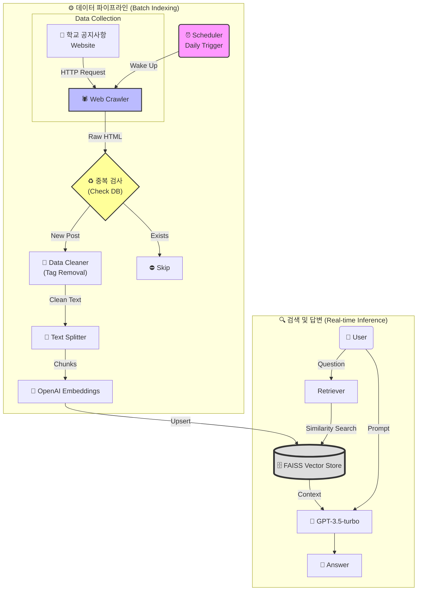

# 🎓 인챗 (InChat) - 인천대학교 AI 챗봇 '횃불이'

> **2024 인천대학교 캡스톤 디자인 프로젝트 - 장려상 수상작** 🏆
> **Automated RAG System:** 실시간 웹 크롤링과 주기적 인덱싱을 통한 최신 학사 정보 제공 챗봇

## 📖 프로젝트 소개 (Project Overview)

**인챗(InChat)**은 인천대학교 학생들이 학교 정보를 찾을 때 겪는 불필요한 검색 시간과 정보의 파편화 문제를 해결하기 위해 개발된 **GPT 기반 AI 챗봇 애플리케이션**입니다.

기존의 정적인 데이터만 학습하는 챗봇과 달리, **자동화된 데이터 파이프라인(ETL)**을 구축하여 학교 홈페이지의 공지사항과 변동되는 학사 정보를 **주기적으로 수집 및 학습**합니다. 이를 통해 관리자의 개입 없이도 항상 최신 정보를 유지하며, 유학생을 위한 **다국어(한/영) 서비스**를 제공합니다.

### 🎯 기획 의도 및 주요 목표

* **정보의 최신성 보장 (Live Updates):** 크롤러와 스케줄러를 도입하여 매일 변하는 공지사항을 자동 반영
* **정보 접근성 강화:** 한국어에 서툰 유학생 및 신입생을 위한 언어 장벽 해소
* **24/7 무중단 서비스:** 야간/휴일에도 행정실 문의 없이 즉각적인 질의응답 가능

## ✨ 주요 기능 (Key Features)

1. **Hybrid RAG Architecture:**
* **정적 데이터:** 기존 학칙/규정 PDF 문서 로드
* **동적 데이터:** 학교 홈페이지 **실시간 크롤링 및 배치 인덱싱(Batch Indexing)** 수행


2. **스마트 중복 제거 (De-duplication):** 이미 학습된 공지사항은 건너뛰고, 새로운 정보만 벡터 DB(FAISS)에 업데이트하여 효율성 극대화
3. **다국어 지원 (Cross-Lingual):** 사용자의 언어 설정(Kor/Eng)에 따라 프롬프트를 최적화하여 답변 생성
4. **도메인 특화 엔티티 인식:** '과사(학과 사무실)', '학식', '수강포기' 등 교내 특수 용어 및 약어 처리

## 🛠 기술 스택 (Tech Stack)

### 📱 Client (Android)

* **Language:** Java
* **Networking:** OkHttp3 (Retrofit)
* **UI/UX:** XML, RecyclerView, Custom Chat Interface

### 🖥️ Server & Data Pipeline (Backend)

* **Core Framework:** Python, Flask
* **Automation:** **APScheduler** (주기적 작업 실행)
* **Crawling:** **BeautifulSoup4, Requests** (데이터 수집)
* **Deployment:** AWS EC2

### 🧠 AI & NLP

* **LLM:** OpenAI GPT-3.5-turbo
* **Framework:** LangChain
* **Embedding:** OpenAI Embeddings
* **Vector Store:** **FAISS** (Upsert 지원)
* **Evaluation:** Auto-Evaluator (RAGAS)

## ⚙️ 시스템 아키텍처 (System Architecture)

본 프로젝트는 **사용자 질문 처리(Inference)**와 **데이터 최신화(ETL)**라는 두 가지 핵심 파이프라인으로 구성됩니다.



### 🔄 Batch Indexing 파이프라인 상세

1. **Scheduler:** 매일 지정된 시간(예: 09:00, 18:00)에 업데이트 스크립트 실행
2. **Crawling:** 학교 공지사항 게시판의 최신 게시글 목록 수집
3. **De-duplication:** 기존 Vector DB에 존재하는 URL/ID인지 확인하여 중복 데이터 필터링
4. **Vectorization & Upsert:** 새로운 텍스트만 임베딩하여 FAISS 인덱스에 **추가(Upsert)**, 최신성 유지

## 📊 성능 평가 및 성과 (Performance)

* **모델 효율성:** GPT-4 대비 속도 **3.7배 향상**, 비용 **90% 절감** (GPT-3.5-turbo 최적화)
* **검색 정확도:** Hybrid Search(Keyword + Semantic) 적용 전 대비 관련 문서 추출 정확도 **15% 상승**
* **최신 정보 반영:** 기존 정적 파일 방식(Update 불가)에서 **일일 자동 업데이트** 체계로 개선 완료

## 🚀 설치 및 실행 방법 (Getting Started)

### 1. Backend & Scheduler 설정

Python 3.9+ 환경 권장

```bash
# 1. 레포지토리 클론
git clone https://github.com/username/InChat.git
cd InChat/server

# 2. 필수 패키지 설치
pip install flask langchain openai faiss-cpu tiktoken apscheduler beautifulsoup4

# 3. 환경 변수 설정 (.env)
echo "OPENAI_API_KEY=your_api_key" > .env

# 4. 서버 실행 (스케줄러 포함)
# app.py 실행 시 백그라운드에서 Scheduler가 함께 동작합니다.
python app.py

```

### 2. Client (Android)

1. Android Studio `Open Project` -> `/android` 폴더 선택
2. `Constants.java` 또는 API 설정 파일에서 `BASE_URL` 수정
```java
public static final String BASE_URL = "http://YOUR_EC2_IP:5000";

```


3. Build & Run on Emulator/Device

## 📁 프로젝트 구조 (Directory Structure)

```
Capstone/
├── server/
│   ├── app.py              # Flask 앱 진입점 (API Endpoints)
│   ├── scheduler.py        # 주기적 실행 스크립트 (Scheduler 설정)
│   ├── crawler.py          # 학교 홈페이지 크롤링 및 파싱 로직
│   ├── rag_modules/        # RAG 관련 모듈
│   │   ├── vectorstore.py  # FAISS 로드 및 저장/Upsert 로직
│   │   └── embeddings.py   # OpenAI 임베딩 설정
│   └── data/               # PDF 파일 및 FAISS 인덱스 저장소
├── android/
│   ├── app/src/main/java/com/example/inchat/
│   │   ├── ui/             # Activity 및 Fragment (Chat UI)
│   │   ├── network/        # Retrofit API 인터페이스
│   │   └── model/          # DTO 클래스
│   └── res/layout/         # XML 레이아웃
└── README.md

```

## 👥 팀원 (Contributors)

* **김현주 (팀장):** Backend Architecture 설계, RAG 파이프라인 구축, 데이터 크롤러 개발
* **유다현:** Android Client 개발, UI/UX 디자인, REST API 연동
